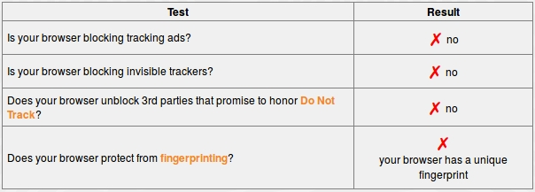
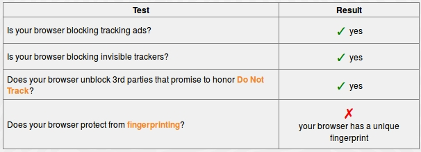

## Welcome to Browser Extensions and Security for the [PDX Women In Tech (PDXWIT) CryptoParty](https://www.meetup.com/ChickTech-Portland/events/240049691/)!

This information will provide a quick overview about why you should care about browser privacy and about the extensions you can easily use to enhance your privacy.

### What is your current level of tracking protection?

First, a quick checkup to see where we're at now.  Go to Panopticlick at [https://panopticlick.eff.org/](https://panopticlick.eff.org/), a free checkup tool provided by the [EFF (Electronic Frontier Foundation)](https://www.eff.org/).

On first run of the tool, you may see results that look like this:

What does all of this mean?  Let's go through step by step.

### Blocking ads
TODO: ...not just annoying, but potentially invasive....(why you should care, etc)
#### No longer an all-or-nothing approach
TODO: explain how to support content providers without giving up so much privacy

### Invisible Trackers?

Everyone has heard of web cookies (which store small amounts of data from a website you visit), but 'invisible trackers' sound (and are) much more ominous. These invisible trackers  ("non-visible tracking beacons") are often scripts that runs in the background, as opposed to say, a visible ad.  They may track you across [multiple domains](https://medium.com/building-contently/tracking-people-across-multiple-domains-when-cookies-just-arent-enough-b270cc95beb1) and broadly share your information.

Internet tracking is an entire industry, it may track you from site to site storing a wide variety of your keystrokes and clicks, and has evolved significantly beyond simple single-site cookies. This practice is very [widespread](https://webtransparency.cs.princeton.edu/webcensus/index.html#results).

#### Why you should care about invisible trackers

Internet tracking is about much more than annoying ads. From an [article](http://www.itworld.com/article/2710565/it-management/four-reasons-why-you-should-worry-about-online-tracking--and-advertising-isn-t-one-of-them-.html) on ITWorld.com, four good reasons why you should worry about tracking are:

1. **Variable pricing**: Websites can charge you more if they know what you might be willing to pay
2. **Tracking your interests a bit too far**: If a website knows your every 'like', they can develop a profile of you and make *very* personal assumptions.
3. **Weblining**: Similar to 'redlining', this may allow companies to make assumptions about you that lead to business decisions that may negatively impact you, such as charging you more for insurance if you smoke.
4. **False Assumptions**: If you share a browser with others or create multiple fake profiles to disguise yourself, you could still suffer the similar unfair business or pricing practices described above.

#### What you can do about it
[Privacy Badger](https://www.eff.org/privacybadger) is one of the most common browser extensions for tracker protecton is created directly by EFF.

From the Privacy Badger [FAQ](https://www.eff.org/privacybadger#faq-What-is-Privacy-Badger?):
>Privacy Badger is a browser add-on that stops advertisers and other third-party trackers from secretly tracking where you go and what pages you look at on the web.  If an advertiser seems to be tracking you across multiple websites without your permission, Privacy Badger automatically blocks that advertiser from loading any more content in your browser.  To the advertiser, it's like you suddenly disappeared.

###  3rd parties that promise to honor Do Not Track:
TODO text

### Now, recheck your current level of tracking protection!

At this point you will likely see three green checkmarks, but still that last pesky red X.  Why is that?

#### Browser fingerprinting
Getting rid of your browser fingerprint is much, much trickier than a simple browser extension.  One [article] (https://nakedsecurity.sophos.com/2014/07/28/panopticlick-reveals-the-cookie-you-cant-delete/) calls it "the cookie you can't delete".

---
## Some other browser extensions to consider
As this is a short intro, this barely scratches the surface....
