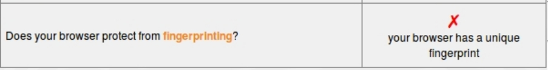

## Welcome to Browser Extensions and Security for the [PDX Women In Tech (PDXWIT) CryptoParty](https://www.meetup.com/ChickTech-Portland/events/240049691/)!

This information will provide a quick overview about why you should care about browser privacy and about the extensions you can easily use to enhance your privacy.

### What is your current level of tracking protection?

First, a quick checkup to see where we're at now.  Go to Panopticlick at [https://panopticlick.eff.org/](https://panopticlick.eff.org/), a free checkup tool provided by the [EFF (Electronic Frontier Foundation)](https://www.eff.org/).

On first run of the tool, you may see results that look like this:

What does all of this mean?  Let's go through step by step.

      

### Ad block

Ads can be annoying or invasive, and some may track and share information about what you click.

One of the most common ad-blockers is [Ad Block Plus](https://adblockplus.org/).

#### No longer an all-or-nothing approach

* A somewhat newer approach to ad blocking allows some ads to load when they are non-tracking and non-invasive. See Ad Block Plus' [Acceptable Ad](https://adblockplus.org/acceptable-ads) page. 

* This approach allows you to support content providers (such as a newspaper for example) as long as their advertisers agree to 'play nice'

      

### Invisible Trackers

* **Old school**: Cookies - store small amounts of data from websites you visit 

  * Used to track single site, stored minimal data

 

* **Now**: 'Invisible trackers' - much more ominous. (Cookies on steriods)

  * "non-visible tracking beacons" are often scripts that runs in the background, as opposed to say, a visible ad.  

  * They may track you across [multiple domains](https://medium.com/building-contently/tracking-people-across-multiple-domains-when-cookies-just-arent-enough-b270cc95beb1) and broadly share your information.

* Internet tracking is an entire industry, 
 
  * May track you from site to site storing a wide variety of your keystrokes and clicks, and has evolved significantly beyond simple single-site cookies. 
  
  * This practice is very [widespread](https://webtransparency.cs.princeton.edu/webcensus/index.html#results).

      

#### Why you should care about invisible trackers

Internet tracking is about much more than annoying ads. From an [article](http://www.itworld.com/article/2710565/it-management/four-reasons-why-you-should-worry-about-online-tracking--and-advertising-isn-t-one-of-them-.html) on ITWorld.com, four good reasons why you should worry about tracking are:

1. **Variable pricing**: Websites can charge you more if they know what you might be willing to pay

2. **Tracking your interests a bit too far**: If a website knows your every 'like', they can develop a profile of you and make *very* personal assumptions.

3. **Weblining**: Similar to 'redlining', this may allow companies to make assumptions about you that lead to business decisions that may negatively impact you, such as charging you more for insurance if you smoke.

4. **False Assumptions**: If you share a browser with others or create multiple fake profiles to disguise yourself, you could still suffer the similar unfair business or pricing practices described above.

      

#### What you can do about it
[Privacy Badger](https://www.eff.org/privacybadger) is one of the most common browser extensions for tracker protecton is created directly by EFF.

From the Privacy Badger [FAQ](https://www.eff.org/privacybadger#faq-What-is-Privacy-Badger?):
>Privacy Badger is a browser add-on that stops advertisers and other third-party trackers from secretly tracking where you go and what pages you look at on the web.  If an advertiser seems to be tracking you across multiple websites without your permission, Privacy Badger automatically blocks that advertiser from loading any more content in your browser.  To the advertiser, it's like you suddenly disappeared.

      

### Do Not Track

* An HTTP header can express a user's desire to not be tracked: [Tracking Preference Expression (DNT)](https://www.w3.org/TR/tracking-dnt/)

* **Important:** This DNT header only expresses your *preference*, websites can [choose to ignore it](https://arstechnica.com/business/2015/11/fcc-wont-force-websites-to-honor-do-not-track-requests/)

* Browsers have settings that enable you to mark "Do Not Track".  See [https://allaboutdnt.com/](https://allaboutdnt.com/):
> DNT is a web browser setting that requests that a web application disable its tracking of an individual user. When you choose to turn on the DNT setting in your browser, your browser sends a special signal to websites, analytics companies, ad networks, plug in providers, and other web services you encounter while browsing to stop tracking your activity.

      

## Now, recheck your current level of browser tracking protection!

At this point you will likely see three green checkmarks, but still that last pesky red X.  Why is that?

      

## Browser Fingerprinting

Getting rid of your browser fingerprint is much, much trickier than a simple browser extension.  One [article](https://nakedsecurity.sophos.com/2014/07/28/panopticlick-reveals-the-cookie-you-cant-delete/) calls it "the cookie you can't delete".

After you run the fingerprinting tool, click on the 'fingerprinting' link to see how unique your browser combintation is.  *(This is one of the rare times that I feel less secure being a Linux user.)*

The reason that it is [hard](https://www.eff.org/privacybadger#faq-Does-Privacy-Badger-prevent-fingerprinting?) to hide this because it is a characteristic of your browser configuration. It is not pratical to block or fake all information, such as the user agent string (ex: 'Mozilla/5.0') from your browser, although some techniques may help.

      

## Some other browser extensions to consider
As this is a short intro, this barely scratches the surface.  I won't attempt to cover more than a few, but some of the favorites that crop up are listed here. Besides changing the browser-provided [settings](https://medium.com/p/4d3b58b4341a#78d0), some are:

* [Ghostery](https://www.ghostery.com/products/): Ghostery detects and blocks tracking technologies on the websites you visit to speed up page loads, eliminate clutter, and protect your data and privacy.  It also keeps you informed on what companies are tracking you and gives you the tools you need to determine what to block and when.  

* [HTTPS Everywhere](https://www.eff.org/https-everywhere): From the EFF, writes requests to these sites to HTTPS

* Lightbeam

* Disconnect

* Flashblock

**Important**: Before installing any extension, make sure to *do your research*: 

* If it's from a reputable organization such as the EFF, then you can likely feel safe installing it.  

* If the extension seems dubious in origin, make sure you do some background digging to make sure you're not accidentally installing malware on your machine, *especially* if the extension seems to be asking for lots of permissions.

